<html>
<body>
<h2>How to Download and Install this Project</h2>
<ol>
<li>Click the Clone or download button and select the Download Zip 
option to download the sample application.</li>
<li>Extract all files from the .zip file.</li>
<li>When extraction is complete, launch Alpha Anywhere and open 
the Alpha Anywhere .adb file located inside the folder where the 
extracted files were saved.</li>
</ol>

For detailed instructions, see 
<a href="https://www.alphasoftware.com/documentation/index?search=how%20to%20download%20a%20sample%20app%20from%20the%20alpha%20anywhere%20github%20repository">
How to download a Sample App from the Alpha Anywhere GitHub Repository</a>.

<h1>FormView Control</h1>

The FormView control is used to create a special type of 'form' on a UX component. Touch-optimized, mobile forms are built using the FormView control, but there are other use cases for this control as well.

&nbsp;

<a href="http://youtu.be/QUpW5LXaoVU">Watch video of a sample 
application that shows a tablet optimized form</a>

<a href="http://downloads.alphasoftware.com/a5v12Download/Private/TabletFormsBeta/TabletForm_Sample_App_V1.zip">
Download component used in video</a>

&nbsp;

<a href="http://www.viddler.com/v/c0810403">Watch video of a sample 
application that shows a phone optimized form</a>

&nbsp;

&nbsp;

The FormView control is an extremely versatile and powerful control 
that allows complex, and highly stylized user interfaces to be build. 
But the basic concepts of the FormView control are actually quite simple 
and this document will explain these concepts.

The key concept of the FormView control (explained in more detail 
below) is that the display of the data in the form (accomplished by 
merging the form data into an HTML template), and the editing of the 
data in each form fields are done using different controls (accomplished 
using 'Field Editor' controls).

The images below show examples of UX components built using the 
FormView control:

&nbsp;

<b>Tablet optimized form examples</b>

The next 3 images show a form that has been optimized for a tablet 
display. The 'form' part displays the values of the the form fields 
(Inspection Date, Inspector Name, Owner, Owner Phone#, Make, Model, 
etc.). A section at the top of the form is where the 'editors' are 
shown. In image 1, the Inspection Date field on the form has focus and 
the editor for this value is open.

&nbsp;

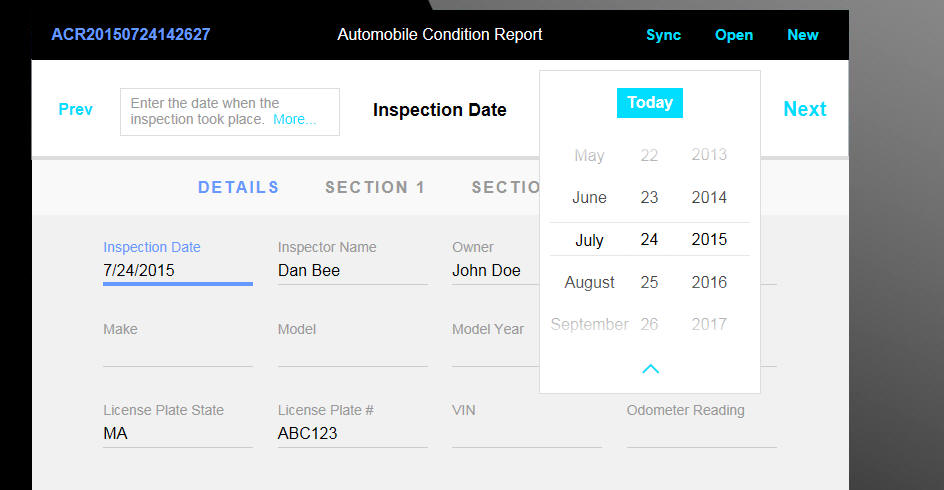

<i>Tablet Form - Image 1</i>

&nbsp;

In image 2, the Inspector Name field on the form has focus and the 
editor for this field is show (highlighted in yellow) in the editing 
section at the top of the screen.

&nbsp;

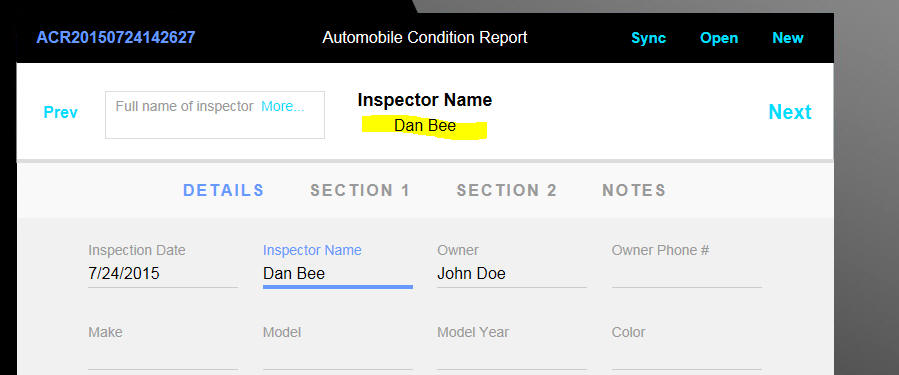

<i>Tablet Form - Image 2</i>

&nbsp;

In image 3, the Owner Phone# field has focus and the editor for this 
value is shown. Note that the editor for the phone number field uses a 
custom keyboard -- not the built in native keyboard. The custom keyboard 
is shown at the top of the screen and it overlays the screen rather than 
pushing the screen up (as the native keyboard would do).

&nbsp;

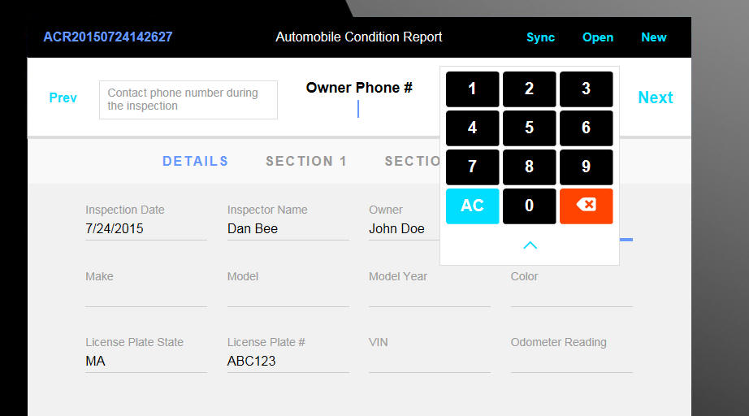

<i>Tablet Form - Image 3</i>

&nbsp;

<b>Phone optimized form examples</b>

The next 4 images show a form that has been optimized for a phone 
display. In the first image the user selects the 'form page' that they 
want to edit. Because the form has a large number fields, the form is 
broken into logical 'pages' which the user can select from the 'Pages' 
list.

&nbsp;

&nbsp;

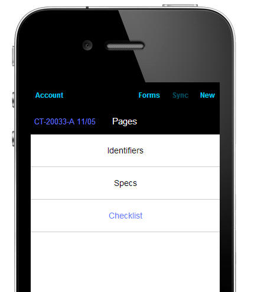

<i>Phone Form - Image 1</i>

&nbsp;

In image 2, the 'Checklist' page of the form is shown. This pages has 
a series of pass/fail questions. Questions that have been answered as 
'passed' are shown in green and questions that have been answered as 
'failed' are shown in red.

&nbsp;

&nbsp;

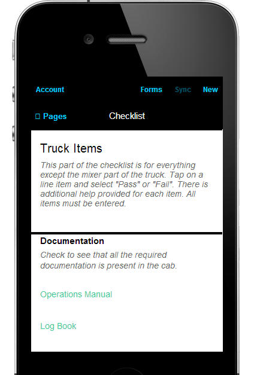

<i>Phone Form - Image 2</i>

&nbsp;

In image number 3, the user has tapped on a question and the 'editor' 
for that question is shown. The editor allows the user to set the 
question answer to pass or fail.

&nbsp;

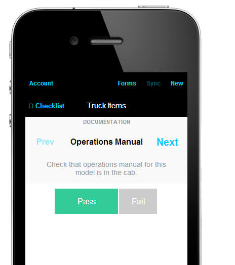

<i>Phone Form - Image 3</i>

&nbsp;

In mage 4 shown below a specialized 'editor' is shown. This is an 
example of how editors can be constructed to make answering particular 
types of questions easy. For example, this editor is designed to allow 
the operation to measure the rotational speed of a drum.

&nbsp;

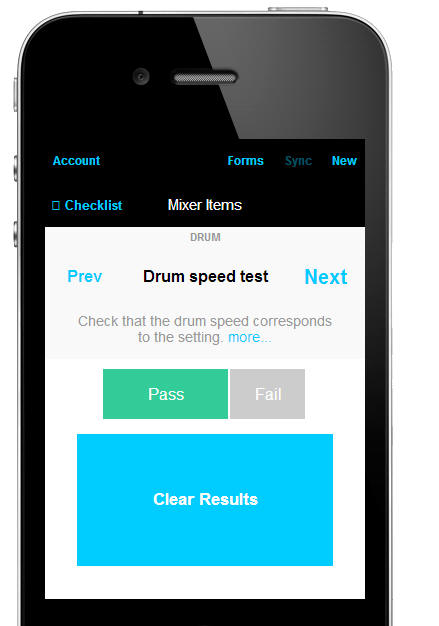

<i>Phone Form - Image 4</i>

&nbsp;

<h2>Basic Concepts</h2>

<i>Data Source</i>

The FormView control has a 
data source. The data 
source contains the data that the FormView control will display 
and edit (if the FormView is editable - it does not have to be). The
data source can be a 
List Control, an arbitrary Javascript object, or some other controls on 
the UX.

The most common data source for FormView controls, however, is the 
List Control. When you specify that the List control is the data source 
for the FormView, you get a lot of very helpful built-in behavior. For 
example, clicking on a row in the List will populate the FormView with 
data from that row (much like the behavior you get in a List with a 
Detail View). 

<b>NOTE</b>: A common design pattern is to define a List 
control and turn on its Detail View property, but to actually use a 
FormView control to define the List's Detail View (rather than adding 
individual controls, such as text box controls, for the List's Detail 
View).

&nbsp;

<i>HTML Template</i>

The actual layout of the FormView control is defined by an HTML 
template. This means that you can use the full expressive power of HTML 
and CSS to create beautiful forms.

<b>NOTE</b>: The HTML shown in the FormView control is 
obtained by merging data from the FormView control's data source into a 
template. The template a standard template used by Alpha Anywhere's 
client-side templating feature. For more information on client-side 
templates, search Release Notes for 'Client-side Templates'.

Because the HTML that is displayed in the FormView is generated using 
client-side templating, it is easy to add features to the form such as 
conditional sections, etc.

<i>Editor Sets and Editors</i>

The data shown in the FormView control is generally not directly 
editable. Instead, when the user taps on a field value shown in the 
FormView, an editor is 
opened to edit the value. The editor is contained in an
editor set.&nbsp; After 
the user edits the field value in the
editor, and saves the 
edit, the FormView control is updated with the edited value.

Editors are a shared resource. Many fields on a FormView control can 
share the same editor. 
However, even though many fields on a form can share the same editor, 
each time an editor is invoked to edit the value in a field, that field 
can pass a custom settings 
object to the editor to customize aspects of the editor's behavior. 

By using shared editors, very large forms can be built, while still 
keeping the UX component itself relatively small and efficient.

Certain types of field values can be edited directly on the Form 
(without having to go to a separate
editor). For example, a 
'switch' control, which shows an On/Off value could be toggled directly 
on the FormView control. The switch control shown on the Form is called 
an immediate editor.

Editors are built using standard UX component controls. So, for 
example, some editors might allow the user to type a value into a text 
box control, while other editors will provide a list of choices (shown 
in a List control).

An editor set can 
contain several different 
editors. For example, in a touch optimized mobile form running on 
a phone, the editor set might be in its own Panel Card. When the user 
taps on a field on the Form, the Panel Card containing the selected 
editor would be animated into view. Once the user has made the edit and 
committed the new value, the Panel Card containing the editor set would 
be animated out of view.

Editor sets and Editors are added to the UX by adding a [Container] 
control (from the Containers section in the UX toolbox) and then 
selecting the appropriate container sub-type.

Alpha Anywhere comes with a number of pre-defined editors. These are 
shown in the Other Controls section of the UX Component toolbox.

&nbsp;

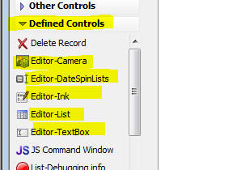

&nbsp;

&nbsp;

<h2>Adding a FormView control to a UX Component</h2>

To add a FormView control to a UX component, select the [FormView] 
item from the toolbox in the Other Controls section.

&nbsp;

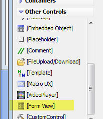

&nbsp;

Once you have added a FormView control to the UX, the property sheet 
for the control will have a Form properties item that you can click to 
open the FormView builder.

&nbsp;

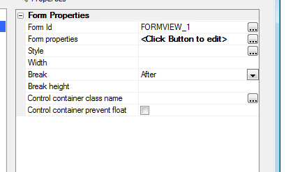

&nbsp;

The FormView editor is shown in the image below.

&nbsp;

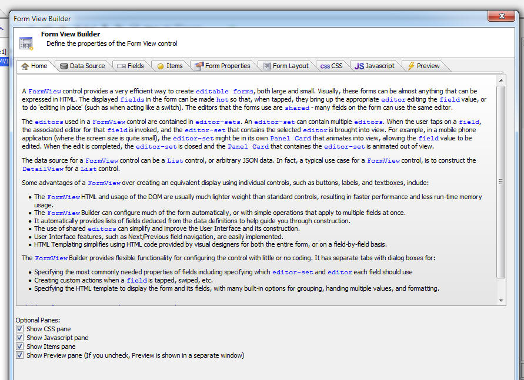

&nbsp;

To get an understanding of the various panes in the FormView editor, 
please watch the Introductory Videos, listed below.

&nbsp;

&nbsp;

<h2>Introductory Videos</h2>

&nbsp;

				
&nbsp;

&nbsp;

				
&nbsp;

				
&nbsp;

&nbsp;

<b>Sample Mobile Forms Cement Truck Inspection Application</b>

The sample Mobile Forms Cement Truck Inspection application is 
intended to be used as a reference application showing a rich example of 
a mobile forms application optimized for use on a phone. The sample 
component can be download using
<a href="http://downloads.alphasoftware.com/a5v12Download/CementTruckSample/CementTruck.zip">
this link</a>. The videos listed below give an in-depth description of 
how the component was constructed.

&nbsp;

<i>Screen shot of one of the pages in the sample Cement Truck 
Inspection application</i>

&nbsp;

&nbsp;

These videos, along with comments throughout the component in 
JavaScript code and on controls, serve as documentation of the inner 
workings of the MobileFormsCementTruck.a5wcmp UX component.

MobileFormsCementTruck.a5wcmp is a sample component that implements 
functionality for doing offline data collection with synchronization 
back to a server, including user authentication. 
 
The app was built to have a carefully crafted user interface, along with 
extra code to facilitate debugging any changes that would be made to the 
app and to do demonstrations and training of its use. The app provides a 
starting point for a flat-file, multi-page, mobile forms-driven, 
off-line-centric data collection application. 
 
The app was designed to be modified so that it can be customized for 
your specific use case. It is not a simple sample for learning how to 
develop an app in Alpha Anywhere. It is a full implementation of most of 
its features, with extra code to handle special cases that are often 
left as &quot;an exercise for the reader&quot; in other samples. It uses whatever 
was necessary in Alpha Anywhere to accomplish its goals, without concern 
for ease of programming or use of built-in or codeless features of Alpha 
Anywhere. Some of what it accomplishes with complex JavaScript and CSS 
may end up being made easier in future versions of Alpha Anywhere, or 
may already have simpler solutions. 
 
What this app does is give an Alpha Anywhere developer working code 
which they can either use as a complete base for minor or major 
modifications, or use as examples from which to copy or compare small 
snippets of code and formatting. 
 
These videos are aimed at a developer already familiar with the 
facilities in Alpha Anywhere, such as the various forms of panels and 
containers, the common properties of many controls as well as the 
events, and the general use of editors, ViewBoxes, and FormViews. They 
also assume familiarity with HTML, CSS, and JavaScript, and their use by 
a developer working in Alpha Anywhere. 
 
These videos are not intended as an introduction to Alpha Anywhere. 
Basic concepts and operation of the development environment are not 
covered and knowledge of that is assumed. 
 
What follows is a list of the videos, along with a short explanation of 
each. They were created assuming that they would initially be viewed in 
order. Most of the later videos assume that the viewer has watched the 
first four. 
 
&nbsp;

 
 
<b>Mobile Forms: Cement Truck Sample (16:22) </b> 
This is the first video in this series. It shows the capabilities of the 
app, going over most of the screens. It does not assume knowledge of 
Alpha Anywhere development, and may be viewed by non-developers to see 
an example of the look and feel, and functionality, of a basic mobile 
Alpha Anywhere data capture application running on a smartphone.

<a href="http://www.viddler.com/v/c0810403">Watch Video</a> 
 
<b>Alpha Anywhere Mobile Forms Cement Truck: Installing (12:09)</b> 
This video shows how to take the Zip File that has the sample's files 
and bring them into Alpha Anywhere. It includes setting up the required 
connection string and user security information. [A link to the zip file 
is needed somewhere, such as here.]

<a href="http://www.viddler.com/v/6cc33c2e">Watch Video</a> 
 
<b>Alpha Anywhere Mobile Forms Cement Truck: Panel Structure (12:27)</b> 
This video goes over the structure of the different screens shown by the 
app, and the panel cards, panel navigators, and panel layouts that 
implement those screens. It also goes over the use of panel overlays, 
and shows the use of comments in the UX's Controls View in the Alpha 
Anywhere development environment.

<a href="http://www.viddler.com/v/379d7776">Watch Video</a> 
 
<b>Alpha Anywhere Mobile Forms Cement Truck: Overview of the Code 
(14:14)</b> 
This video explains the general organization of the custom JavaScript 
functions used by the app. It includes detailed explanations of how the 
custom {dialog.object}.Messaging functions in the app are used to 
initialize, show, and hide panel overlays for alerts, dialogs, and other 
purposes.

<a href="http://www.viddler.com/v/b9fbb8c3">Watch Video</a> 
 
<b>Alpha Anywhere Mobile Forms Cement Truck: Logging In the User (24:11)</b> 
This video explains the three forms of user authentication supported by 
the app. It covers both the JavaScript and Xbasic code implementing 
those features. It also covers some of the code related to 
synchronization and how that is related to user authentication. 
<a href="http://www.viddler.com/v/4e575762">Watch Video</a>

 
<b>Alpha Anywhere Mobile Forms Cement Truck: Lists and Form (27:27)</b> 
This video goes over the properties and settings for the list of forms, 
the list of pages, and the FormView that displays the data fields. 
<a href="http://www.viddler.com/v/e12ce955">Watch Video</a>

 
<b>Alpha Anywhere Mobile Forms Cement Truck: New Record (11:49)</b> 
This video shows how the New button functionality is implemented, 
including the lookup of a scanned QR code. It also shows the 
implementation of deleting a record.

<a href="http://www.viddler.com/v/279816c0">Watch Video</a> 
 
<b>Alpha Anywhere Mobile Forms Cement Truck: Editors (37:03)</b> 
This video goes over how the data field editors are implemented, 
including the shared code and shared controls that are common to 
multiple editors. It also shows how the app-specific &quot;speed test&quot; timing 
editor is implemented.

<a href="http://www.viddler.com/v/e32082ab">Watch Video</a> 
 
<b>Alpha Anywhere Mobile Forms Cement Truck: Handling Synchronization 
Errors (22:21)</b> 
This video shows how the app responds to server-side data validation and 
write-conflict errors. It includes how it displays those errors, and how 
it implements a user-traversable list of the fields with errors to be 
addressed.

<a href="http://www.viddler.com/v/1e0c2bde">Watch Video</a> 
 
<b>Alpha Anywhere: Custom CSS in a UX Component (23:10)</b> 
This is a general video for Alpha Anywhere developers, and is not 
specific to this app. It does, though, cover techniques that are used in 
the next video which is specific to this app and should be viewed before 
that video. This video covers some of the default HTML and CSS that is 
used for most normal Alpha Anywhere controls, and shows how to do 
commonly needed modifications to that code through various control and 
component properties.

<a href="http://www.viddler.com/v/b9268823">Watch Video</a> 
 
<b>Alpha Anywhere Mobile Forms Cement Truck: Custom CSS (28:55)</b> 
This video shows how the app uses custom CSS classes and styles, and 
custom sub-themes, to give the app the visual appearance that it has. It 
also shows the history of that design, and how it came about from the 
work of a UX/visual designer with concern for the user experience and 
not with how it might be implemented using Alpha Anywhere.

<a href="http://www.viddler.com/v/8b7668b3">Watch Video</a>

 
 
<b>Alpha Anywhere Mobile Forms Cement Truck: PhoneGap (9:23)</b> 
This last video shows the settings used to publish the app as a normal 
PhoneGap application for distribution. It also shows how the QR-code 
scanning functionality is accomplished with a PhoneGap plug-in, as well 
as the iOS-specific code for the device statusbar.

<a href="http://www.viddler.com/v/b8617761">Watch Video</a>

</body>
</html>
